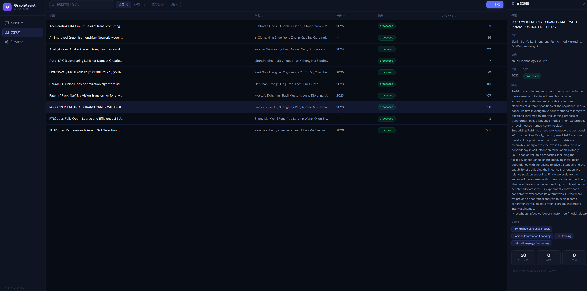

# GraphAssistant

本项目是一个面向学术文献场景的本地知识库助手，围绕"文献入库 -> 检索召回 -> 图谱增强 -> 问答/研究/Idea 生成"构建完整链路。

提供两套使用入口：
- **FastAPI 后端**：接口调用、Swagger 调试、与 React 前端通信
- **React 前端**（Vite/TypeScript）：聊天、文献管理、知识图谱可视化（主要入口）
- **Streamlit 前端**：备用 UI，含文献管理、多轮问答、深度研究、社区检测、图谱页面



---

## 1. 项目目标

GraphAssistant 主要解决以下问题：
- 将 PDF / DOCX / TXT 学术文献并发解析为可检索、可追踪、可管理的数据资产
- 同时构建向量索引、元数据库和知识图谱，实现语义检索、图增强检索、关键词检索、混合检索、LigRAG论文中的双极检索
- 支持多轮问答、会话持久化、深度研究报告和 Idea 挖掘
- 对文档入库过程提供状态管理、失败定位和实时可视化追踪
- 在不全量重建的前提下，参考LigRAG实现增量入库、关系索引、局部删除和图谱扩展
- 通过统一的 MasterAgent 统一调度所有能力，实现AgenticRAG。

---

## 2. 当前能力概览

### 2.1 文献入库

- 支持 `PDF`、`DOCX`、`TXT` 三种文档格式
- 可选开启**多模态提取**：对 PDF 中的图片、表格调用视觉 LLM（`qwen-vl-plus`）生成描述文本，写入独立 chunk
- 自动提取标题、作者、机构、年份、摘要、关键词等元数据
- 文本切块后同步写入：
  - SQLite 元数据数据库
  - FAISS chunk 向量索引
  - Relation FAISS 关系向量索引
  - Neo4j 文档图谱
- 可选开启实体与关系抽取，构建知识图谱（`Entity`、`RELATES_TO`）
- 可选开启引用提取，构建 `Document -[:CITES]-> Reference`

### 2.2 入库状态机

文档状态流转：`pending → parsing → chunking → metadata → indexing → graph → citations → extracting → processed / failed`

- 每个阶段实时更新，前端可查看当前状态、步骤、chunk 数、实体数、错误信息
- 单文件入库支持"后台启动 + 前端轮询状态"
- 支持 chunk 追踪、关系来源追踪、错误定位

### 2.4 MasterAgent（统一入口）

- 通过 SSE 流式输出与前端实时交互
- 内置 8 个工具，自动路由到相应能力：
  - `retrieve_knowledge` — 知识检索（支持全部6种检索模式）
  - `deep_research` — 深度研究报告生成
  - `generate_research_ideas` — Idea 挖掘
  - `list_documents` — 文献列表查询
  - `get_document_metadata` — 文献元数据查询
  - `search_by_entity` — 实体检索
  - `get_knowledge_graph_stats` — 图谱统计
  - `save_user_memory` — 用户记忆保存
- 支持 Session 持久化（JSONL）、自动会话压缩、Token 用量与费用统计
- 后台异步提取对话记忆写入长期记忆库

### 2.5 社区检测

- 基于 Neo4j 中的 `RELATES_TO` 图构建 NetworkX 无向图
- 使用 Louvain 算法划分社区
- 对每个社区调用 LLM 生成摘要，写入 `Community` 节点与 `BELONGS_TO` 关系

### 2.6 图谱可视化（React 前端）

- 图谱统计：节点数/关系数/各类型分布
- 子图查询：按节点类型过滤、关键词搜索
- 力导向图交互：节点拖拽、缩放、点击查看详情
- 社区检测触发与结果展示

---

## 3. 核心架构

```text
原始文献
  -> DocumentParser（PDF/DOCX/TXT + 多模态图表提取）
  -> SectionChunker / DocumentChunker
  -> MetadataExtractor（LLM 提取元数据）
  -> IngestionPipeline
     -> SQLite（文献元数据）
     -> FAISS（chunk 向量）
     -> Relation FAISS（关系向量）
     -> Neo4j（Document / Chunk / Entity / Relation / Reference / Community）
     -> DocumentStatusStore / ChunkTracker / ExtractionCache

用户查询
  -> MasterAgent（工具路由 + SSE 流式输出）
     -> retrieve_knowledge -> Retriever（semantic / hybrid / graph / local / global / mix）
     -> deep_research -> DeepResearchAgent
     -> generate_research_ideas -> IdeaAgent
     -> list_documents / get_document_metadata -> SQLite
     -> search_by_entity -> Neo4j
     -> get_knowledge_graph_stats -> Neo4j
     -> save_user_memory -> LongTermMemory
  -> LLM 生成答案 / 研究报告 / Idea
```

### 3.1 核心模块职责

| 模块 | 作用 |
|------|------|
| `src/ingestion/document_parser.py` | 文档解析（PDF/DOCX/TXT）+ 多模态内容提取 |
| `src/ingestion/chunker.py` | 固定大小文本切块 |
| `src/ingestion/section_chunker.py` | 章节感知切块 |
| `src/ingestion/section_recognizer.py` | 章节类型识别 |
| `src/ingestion/metadata_extractor.py` | LLM 元数据提取（降级为正则） |
| `src/ingestion/entity_extractor.py` | LLM 实体/关系抽取 |
| `src/ingestion/citation_extractor.py` | 参考文献提取 |
| `src/ingestion/description_merger.py` | 实体描述合并（多文档去重） |
| `src/ingestion/community_detector.py` | Louvain 社区检测 + LLM 摘要生成 |
| `src/ingestion/modal_processors.py` | 图片/表格视觉 LLM 描述生成 |
| `src/workflows/ingestion_pipeline.py` | 入库主流程编排与增量更新 |
| `src/storage/database.py` | SQLite 元数据持久化（SQLAlchemy） |
| `src/storage/vector_store.py` | FAISS chunk 向量索引 |
| `src/storage/relation_vector_store.py` | FAISS 关系向量索引 |
| `src/storage/graph_store.py` | Neo4j 图谱写入与查询 |
| `src/storage/document_status_store.py` | 文档状态机持久化 |
| `src/storage/chunk_tracker.py` | doc_id → chunk_ids 映射 |
| `src/storage/extraction_cache.py` | 解析结果缓存 |
| `src/retrieval/retriever.py` | 语义（FAISS）检索 |
| `src/retrieval/bm25_retriever.py` | BM25 关键词检索 |
| `src/retrieval/hybrid_retriever.py` | FAISS + BM25 + RRF 融合 |
| `src/retrieval/graph_retriever.py` | Neo4j 实体感知检索 |
| `src/retrieval/local_retriever.py` | LightRAG Local 检索 |
| `src/retrieval/global_retriever.py` | LightRAG Global 检索 |
| `src/retrieval/mix_retriever.py` | 三路 RRF 混合检索 |
| `src/retrieval/lightrag_retriever.py` | LightRAG 双极检索 |
| `src/retrieval/keyword_extractor.py` | LLM 关键词提取（ll/hl 双层） |
| `src/retrieval/reranker.py` | 外部 Reranker API |
| `src/retrieval/fusion.py` | RRF 融合算法 |
| `src/retrieval/time_filter.py` | 时间感知过滤 |
| `src/agents/master_agent.py` | MasterAgent（工具路由、SSE 流式、会话持久化） |
| `src/agents/qa_agent.py` | QA Agent（兼容层） |
| `src/agents/deep_research_agent.py` | 深度研究 Agent |
| `src/agents/idea_agent.py` | Idea 生成 Agent |
| `src/agents/session_manager.py` | 会话 JSONL 持久化 + 自动压缩 |
| `src/agents/tool_registry.py` | 工具定义与注册表 |
| `src/agents/memory_extractor.py` | 后台异步记忆提取 |
| `src/agents/events.py` | SSE 事件类型定义 |
| `src/infrastructure/config.py` | 配置管理（.env 读取） |
| `src/infrastructure/llm_client.py` | LLM 客户端（text + vision 双工厂） |
| `src/infrastructure/embedder.py` | 向量 Embedding |
| `src/infrastructure/token_tracker.py` | Token 用量与费用追踪 |
| `src/infrastructure/resilience.py` | 重试与熔断机制 |
| `src/infrastructure/long_term_memory.py` | 长期记忆读写 |
| `src/infrastructure/json_utils.py` | JSON 提取（兼容 markdown 包裹、嵌套等） |

### 3.2 Prompt 组织

所有 LLM Prompt 集中在 `prompt/` 目录，按用途分类：

| 文件 | 用途 |
|------|------|
| `master_agent.md` | MasterAgent 系统 Prompt |
| `qa_agent.md` / `qa_chain.md` | 问答 Prompt |
| `deep_research_plan.md` | 研究问题拆解 |
| `deep_research_analyze.md` | 子问题分析 |
| `deep_research_report.md` | 报告生成 |
| `idea_agent.md` | Idea 生成 |
| `metadata_extractor.md` | 元数据提取 |
| `relation_extractor.md` | 实体关系抽取 |
| `description_merger.md` | 描述合并 |
| `community_summary.md` | 社区摘要 |
| `session_compact.md` | 会话压缩 |
| `memory_extractor.md` | 记忆提取 |
| `modal_image.md` / `modal_table.md` | 多模态描述 |
| `keyword_extractor_fallback.md` | 关键词抽取兜底 |
| `citation_extractor_fallback.md` | 引用提取兜底 |
| `tools/*.md` | MasterAgent 工具描述 |

---

## 4. 运行环境

### 4.1 基础依赖

- Python `3.10+`
- Conda 环境：`llm_universe`
- Neo4j `5.x`（推荐）
- DashScope API Key（Qwen 系列模型）
- Node.js `18+`（React 前端）

### 4.2 Python 依赖

```bash
pip install -r requirements.txt
```

主要依赖：

| 包 | 用途 |
|----|------|
| `fastapi` / `uvicorn` | Web 框架与 ASGI 服务器 |
| `streamlit` | Streamlit 备用前端 |
| `langchain` 系列 | LLM 编排（部分保留） |
| `neo4j` | Neo4j 驱动 |
| `networkx` + `python-louvain` | 图算法与社区检测 |
| `faiss-cpu` | 向量索引 |
| `rank_bm25` | BM25 检索 |
| `pdfplumber` / `python-docx` | 文档解析 |
| `SQLAlchemy` | ORM |
| `pydantic` / `pydantic-settings` | 数据验证与配置 |
| `sse-starlette` | SSE 支持 |
| `pyvis` | 图可视化（Streamlit 端） |

### 4.3 前端依赖（React）

```bash
cd frontend
npm install
npm run dev    # 开发模式：http://localhost:5173
npm run build  # 生产构建
```

---

## 5. 配置说明

项目通过 `.env` 文件读取配置，可参考 [`.env_example`](./.env_example)。

```env
# LLM
MODEL_NAME=qwen-flash
BASE_URL=https://dashscope.aliyuncs.com/compatible-mode/v1
API_KEY=sk-xxxxx
EMBEDDING_MODEL_NAME=text-embedding-v3
VISION_MODEL_NAME=qwen-vl-plus      # 用于多模态图表提取

# 服务
APP_ENV=development
APP_HOST=127.0.0.1
APP_PORT=8000

# 存储
DATA_DIR=.\data\raw_data
SQLITE_PATH=.\data\metadata.db
FAISS_INDEX_DIR=.\data\faiss
RELATION_FAISS_INDEX_DIR=.\data\relation_faiss

# Neo4j
NEO4J_URI=bolt://localhost:7687
NEO4J_USERNAME=neo4j
NEO4J_PASSWORD=xxx

# LLM 可靠性
LLM_TIMEOUT_SECONDS=30
LLM_MAX_RETRIES=3

# 多模态提取（可选）
ENABLE_MODAL_EXTRACTION=true
MODAL_MAX_IMAGES=20
MODAL_MAX_TABLES=20

# Reranker（可选）
RERANKER_ENABLED=false
RERANKER_API_URL=
RERANKER_API_KEY=
RERANKER_MODEL=BAAI/bge-reranker-v2-m3

# 工具调用限速
TOOL_CALL_MAX_PER_WINDOW=5
TOOL_CALL_WINDOW_SECONDS=60.0
```

### 常用配置项

| 变量 | 说明 |
|------|------|
| `MODEL_NAME` | 主 LLM 模型名称 |
| `VISION_MODEL_NAME` | 视觉 LLM（图表提取），默认 `qwen-vl-plus` |
| `EMBEDDING_MODEL_NAME` | 向量模型名称 |
| `ENABLE_MODAL_EXTRACTION` | 是否开启多模态提取（图片+表格） |
| `MODAL_MAX_IMAGES` / `MODAL_MAX_TABLES` | 每文档最多提取的图片/表格数 |
| `NEO4J_URI` | Neo4j Bolt 地址 |
| `RERANKER_ENABLED` | 是否启用外部 Reranker |
| `TOOL_CALL_MAX_PER_WINDOW` | 工具调用限速（防止 LLM 死循环） |

---

## 6. 快速开始

### 6.1 启动社区版本Neo4j

```bash
neo4j console
```


### 6.2 启动后端

```bash
python main.py
```

启动后可访问：
- Swagger：`http://127.0.0.1:8000/docs`
- 健康检查：`http://127.0.0.1:8000/health`

### 6.3 启动 React 前端（推荐）

```bash
cd frontend
npm run dev
```

访问：`http://localhost:5173`

### 6.4 启动 Streamlit 前端（备用）

```bash
streamlit run app.py
```

访问：`http://localhost:8501`

### 6.5 使用顺序

1. 启动 Neo4j
2. 启动 FastAPI 后端
3. 启动 React 前端（或 Streamlit）
4. 在"文献库"页面上传文档
5. 在"对话"页面使用 MasterAgent 进行问答、研究、Idea 生成
6. 在"图谱"页面查看知识图谱，运行社区检测

---

## 7. 使用方式

### 7.1 React 前端页面

| 页面 | 路由 | 功能 |
|------|------|------|
| 对话 | `/chat` | MasterAgent 多轮对话，含工具调用展示、会话管理 |
| 文献库 | `/library` | 文献上传、状态追踪、删除（含删除动画） |
| 图谱 | `/graph` | 知识图谱可视化、社区检测、节点搜索 |

### 7.2 Streamlit 前端页面

| 页面 | 功能 |
|------|------|
| 🤖 智能对话 | MasterAgent 统一入口（SSE 流式） |
| 文献管理 | 单文件/目录入库、状态查看 |
| 多轮问答 | 传统 QA 问答（兼容层） |
| 深度研究 | 深度研究报告（兼容层） |
| 社区检测 | Louvain 社区检测触发 |
| 知识图谱 | 图谱可视化（pyvis） |

### 7.3 CLI 使用

```bash
# 文献入库
python ingest.py --file "C:/path/to/paper.pdf"
python ingest.py --dir "C:/path/to/papers/" --enable-entity-extraction

# 多轮问答
python chat.py --thread-id t1 --top-k 3 --retriever-mode mix

# 深度研究
python research.py --question "AmpAgent解决了什么问题？" --retriever-mode hybrid
```

### 7.4 API 端点

| 方法 | 路径 | 说明 |
|------|------|------|
| GET | `/health` | 健康检查 |
| GET | `/documents` | 文献列表 |
| POST | `/documents/ingest-file` | 同步入库 |
| POST | `/documents/ingest-file/start` | 异步入库（后台） |
| POST | `/documents/ingest-directory` | 批量入库 |
| GET | `/documents/{doc_id}/status` | 文档详细状态 |
| DELETE | `/documents/{doc_id}` | 精确删除文档 |
| GET | `/documents/{doc_id}/citations` | 文档引用列表 |
| POST | `/agent/chat` | MasterAgent SSE 流式对话 |
| GET | `/agent/sessions` | 会话列表 |
| DELETE | `/agent/sessions/{id}` | 删除会话 |
| GET | `/agent/sessions/{id}/history` | 会话历史 |
| POST | `/chat` | 传统问答（兼容层） |
| POST | `/research` | 深度研究（兼容层） |
| POST | `/idea` | Idea 生成（兼容层） |
| POST | `/community/detect` | 社区检测 |
| GET | `/community/list` | 社区摘要列表 |
| GET | `/graph/stats` | 图谱统计 |
| GET | `/graph/subgraph` | 图谱子图 |

---

## 8. 主要功能详解

### 8.1 MasterAgent 与 SSE 流式

MasterAgent 使用 for-break 循环（最多 10 次迭代），通过 LLM 工具调用决策路由到对应能力。

SSE 事件序列：
```
session_start → thinking → [tool_start + tool_end]* → text_delta* → sources → usage → done
```

`usage` 事件包含本次对话的 prompt/completion token 数与估算费用（CNY）。

### 8.2 文档状态与增量入库

- 文档有稳定 `doc_id`（基于文件内容 hash）
- 内容不变时跳过处理（hash 比对）
- 内容变化时先清理旧 chunk/向量/图谱节点，再增量重建
- 删除文档时精确清理：Chunk → 孤立 Entity → 孤立 RELATES_TO → Document

### 8.3 多模态提取

默认开启（`ENABLE_MODAL_EXTRACTION=true`），每文档默认最多提取 20 张图片 + 20 个表格：
- 图片：调用视觉 LLM 生成图像描述，作为独立 chunk 写入
- 表格：调用视觉 LLM 生成表格摘要，作为独立 chunk 写入

### 8.4 社区检测

触发条件：
1. Neo4j 中存在 Entity 节点且有 `RELATES_TO` 关系
2. Louvain 算法划分后，各社区实体数 ≥ `min_community_size`
3. 自适应阈值：`max(2, round(entity_count / 20))`

写入结果：`Community` 节点 + `Entity -[:BELONGS_TO]-> Community` 关系

### 8.5 长期记忆

- 用户可主动调用 `save_user_memory` 工具保存偏好/规则
- 每轮对话结束后，后台线程自动提取并保存值得归档的记忆
- 三层去重：slug 碰撞 → title 精确匹配 → description Jaccard 相似度 > 0.7

---

## 9. 项目目录

```text
GraphAssitant/
├── app.py                          # Streamlit 前端入口
├── main.py                         # FastAPI 后端入口（v1.1.0）
├── ingest.py                       # 入库 CLI
├── chat.py                         # 问答 CLI
├── research.py                     # 深度研究 CLI
├── demo1.py                        # 多模态提取测试脚本
├── requirements.txt
├── .env_example
│
├── api/
│   ├── schemas.py                  # Pydantic 请求/响应模型
│   └── routers/
│       ├── agent.py                # MasterAgent SSE 接口
│       ├── documents.py            # 文献管理接口
│       ├── chat.py                 # 问答接口（兼容层）
│       ├── research.py             # 研究接口（兼容层）
│       ├── community.py            # 社区检测接口
│       └── graph.py                # 图谱查询接口
│
├── src/
│   ├── infrastructure/             # 基础设施层
│   │   ├── config.py
│   │   ├── llm_client.py           # text + vision 双 LLM 工厂
│   │   ├── embedder.py
│   │   ├── token_tracker.py
│   │   ├── resilience.py
│   │   ├── long_term_memory.py
│   │   └── json_utils.py
│   ├── storage/                    # 存储层
│   │   ├── database.py
│   │   ├── vector_store.py
│   │   ├── relation_vector_store.py
│   │   ├── graph_store.py          # Neo4j（含 elementId 去重）
│   │   ├── document_status_store.py
│   │   ├── chunk_tracker.py
│   │   └── extraction_cache.py
│   ├── retrieval/                  # 检索层（6 种模式）
│   │   ├── retriever.py            
│   │   ├── bm25_retriever.py
│   │   ├── hybrid_retriever.py
│   │   ├── graph_retriever.py
│   │   ├── local_retriever.py
│   │   ├── global_retriever.py
│   │   ├── mix_retriever.py
│   │   ├── lightrag_retriever.py
│   │   ├── keyword_extractor.py
│   │   ├── reranker.py
│   │   ├── fusion.py
│   │   └── time_filter.py
│   ├── ingestion/                  # 入库层
│   │   ├── document_parser.py      # 多模态提取（modal_max_images/tables 参数）
│   │   ├── chunker.py
│   │   ├── section_chunker.py
│   │   ├── section_recognizer.py
│   │   ├── metadata_extractor.py
│   │   ├── entity_extractor.py
│   │   ├── citation_extractor.py
│   │   ├── description_merger.py
│   │   ├── community_detector.py
│   │   └── modal_processors.py     # ImageProcessor / TableProcessor（vision LLM）
│   ├── workflows/
│   │   └── ingestion_pipeline.py   # 入库主流程（delete_document_by_doc_id 优先）
│   └── agents/
│       ├── master_agent.py         # 工具调用两阶段（先 announce，再 execute）
│       ├── qa_agent.py
│       ├── deep_research_agent.py
│       ├── idea_agent.py
│       ├── base_agent.py
│       ├── session_manager.py
│       ├── tool_registry.py
│       ├── tool_prompt_loader.py
│       ├── prompt_loader.py
│       ├── memory_extractor.py     # 后台异步记忆提取（extract_json 去重）
│       ├── tool_call_limiter.py
│       └── events.py
│
├── frontend/                       # React/TypeScript 前端（Vite）
│   ├── src/
│   │   ├── main.tsx
│   │   ├── App.tsx
│   │   ├── api/client.ts           # fetch 封装
│   │   ├── pages/
│   │   │   ├── ChatPage.tsx        # MasterAgent 对话页
│   │   │   ├── LibraryPage.tsx     # 文献库（删除动画、状态轮询）
│   │   │   └── GraphPage.tsx       # 图谱（力导向 + 社区检测）
│   │   ├── components/
│   │   │   ├── Layout/AppLayout.tsx
│   │   │   ├── ChatMessage/
│   │   │   ├── FileUploader/FileUploader.tsx
│   │   │   ├── ToolCallCard/ToolCallCard.tsx
│   │   │   └── ParseProgress/ParseProgress.tsx
│   │   ├── hooks/useSSE.ts
│   │   ├── stores/
│   │   │   ├── chatStore.ts        # Zustand chat 状态
│   │   │   └── documentStore.ts    # Zustand 文档状态
│   │   └── types/index.ts
│   ├── package.json
│   └── vite.config.ts
│
├── ui/                             # Streamlit 前端页面
│   ├── page_agent.py
│   ├── page_documents.py
│   ├── page_chat.py
│   ├── page_research.py
│   ├── page_community.py
│   └── page_graph.py
│
├── prompt/                         # 所有 LLM Prompt 模板
│   ├── *.md
│   └── tools/*.md
│
├── tests/                          # 测试套件
├── doc/                            # 开发文档
│   └── CodeDocx/                  # 代码文档
├── data/                           # 运行时数据（gitignore）
│   ├── metadata.db
│   ├── faiss/
│   ├── relation_faiss/
│   └── sessions/
└── assets/                         # README 图片
```

---

## 10. 技术栈

| 层次 | 技术 |
|------|------|
| LLM（文本） | DashScope / Qwen（`qwen-flash` 等） |
| LLM（视觉） | DashScope / Qwen-VL（`qwen-vl-plus`） |
| 向量检索 | FAISS + `text-embedding-v3` |
| 关系向量检索 | 独立 Relation FAISS |
| 图数据库 | Neo4j 5.x |
| 稀疏检索 | BM25（rank-bm25） |
| 元数据存储 | SQLite + SQLAlchemy |
| 后端框架 | FastAPI + uvicorn |
| 前端（主） | React 18 + TypeScript + Vite + Zustand |
| 前端（备用） | Streamlit |
| 文档解析 | pdfplumber + python-docx |
| 社区检测 | NetworkX + python-louvain（Louvain） |
| 图可视化 | 自定义力导向画布（React）/ pyvis（Streamlit） |

---

## 11. 测试
| 测试文件 | 说明 |
|---------|------|
| `tests/test_document_status.py` | 文档状态流转 |
| `tests/test_incremental_ingest.py` | 增量入库 |
| `tests/test_document_deletion.py` | 精确删除 |
| `tests/test_keyword_extractor.py` | 关键词抽取 |
| `tests/test_relation_vector_store.py` | 关系索引 |
| `tests/test_dual_layer_retrieval.py` | Local / Global / Mix |
| `tests/test_prompt_quality.py` | Prompt 文件完整性 |
| `tests/test_master_agent.py` | MasterAgent 工具路由 |
| `tests/test_graph_api.py` | 图谱 API |
| `tests/test_documents_api.py` | 文档管理 API |

---

## 12. 常见问题

**React 前端无法连接后端**

- 确认 `main.py` 已启动，访问 `http://127.0.0.1:8000/health` 验证
- 检查 `frontend/vite.config.ts` 代理配置是否指向正确端口

**Neo4j 连接失败**
- 检查 `.env` 中 `NEO4J_URI`、用户名、密码
- 确认 Neo4j 服务已启动，Bolt 端口 `7687` 可访问

**社区检测写入 0 个**
- 确认图谱中有 Entity 节点且节点间存在 `RELATES_TO` 关系（需先完成入库+实体抽取）
- 如果文献较少，Entity 数量少，阈值会自动降低（最低为 2）

**文档入库后没有实体**
- 确认入库时开启了实体抽取（`enable_entity_extraction=true`）
- 查看文档状态中的最近错误信息

**DashScope 调用失败**
- 检查 `API_KEY`、`BASE_URL`、模型名称
- 适当调大 `LLM_TIMEOUT_SECONDS`

---

## 13. 参考项目

- [LightRAG](./reference_project/LightRAG)
- [RAG-Anything](./reference_project/RAG-Anything)
- [AgenticRAG](./reference_project/AgenticRAG)
