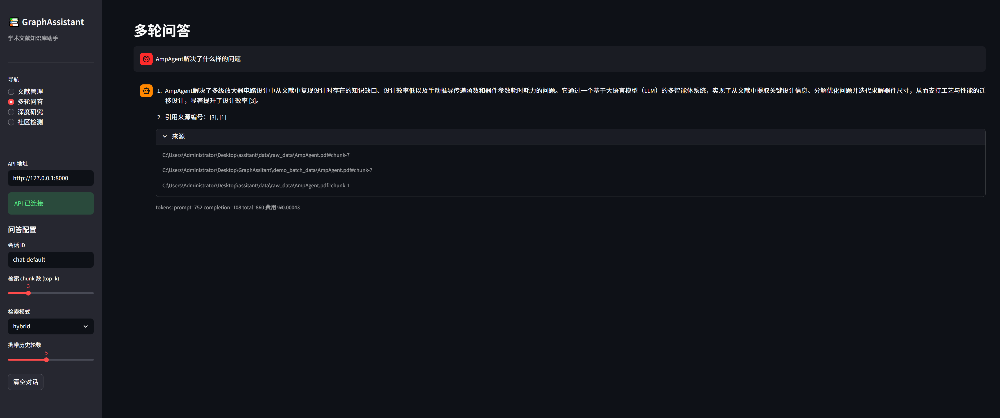
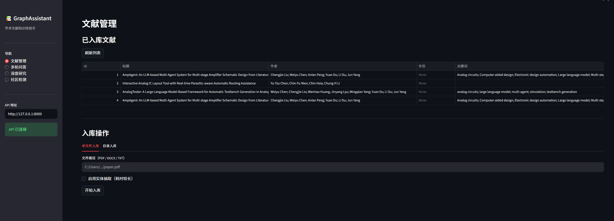
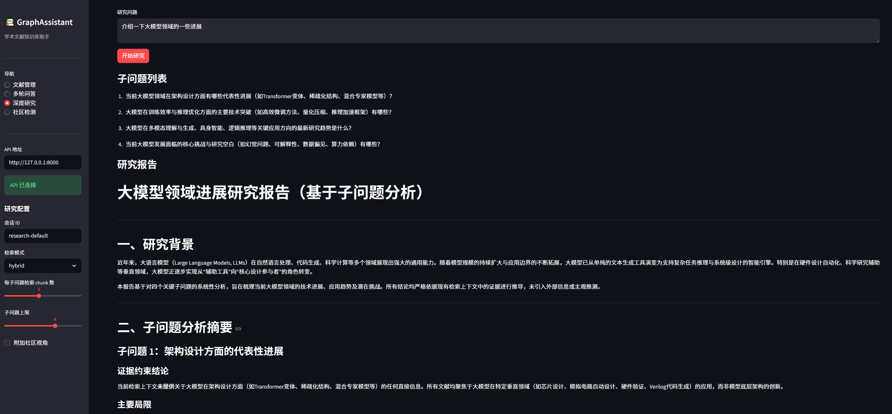

# GraphAssistant

本项目是一个面向学术文献场景的本地知识库助手，围绕“文献入库 -> 检索召回 -> 图谱增强 -> 问答/研究/Idea 生成”构建完整链路。

项目提供两套使用入口：
- FastAPI 后端：用于接口调用、Swagger 调试、与前端通信
- Streamlit 前端：用于文献管理、多轮问答、深度研究、知识图谱可视化





---

## 1. 项目目标

GraphAssistant 主要解决以下问题：
- 将 PDF / DOCX / TXT 学术文献解析为可检索、可追踪、可管理的数据资产
- 同时构建向量索引、元数据库和知识图谱，支持语义检索与图增强检索
- 支持多轮问答、深度研究报告和 Idea 挖掘
- 对文档入库过程提供状态管理、失败定位和实时可视化追踪
- 在不全量重建的前提下，支持增量入库、关系索引、局部删除和图谱扩展

---

## 2. 当前能力概览

### 2.1 文献入库
- 支持 `PDF`、`DOCX`、`TXT` 三种文档格式
- 自动提取标题、作者、机构、年份、摘要、关键词等元数据
- 文本切块后同步写入：
  - SQLite 元数据数据库
  - FAISS chunk 向量索引
  - Neo4j 文档图谱
- 可选开启实体与关系抽取，构建知识图谱
- 可选开启引用提取，构建 `Document -[:CITES]-> Reference`

### 2.2 入库内核增强
- 文档状态机：`pending / parsing / chunking / metadata / indexing / graph / citations / extracting / processed / failed`
- 文档状态可通过 API 和前端查看
- 单文件入库支持“后台启动 + 前端轮询状态”
- 页面可实时显示解析、切块、元数据提取、图写入等阶段
- 支持 chunk 追踪、关系来源追踪、错误定位

### 2.3 检索模式

| 模式 | 说明 | 适用场景 |
|------|------|----------|
| `semantic` | 纯向量语义检索 | 自然语言语义问答 |
| `hybrid` | 向量 + BM25 融合检索 | 一般性查询 |
| `graph` | Neo4j 实体命中 + Chunk 回溯 | 实体关联问题 |
| `local` | 图检索优先 + 语义补充 | 具体方法、模型、数据集问题 |
| `global` | 关系向量索引 + 图关系优先 | 趋势、主题、方向类问题 |
| `mix` | `semantic + local + global` 三路融合 | 复杂综合问题 |

### 2.4 问答与研究
- 多轮问答 Agent
- 深度研究 Agent
- Idea 生成 Agent
- 社区检测与社区摘要
- 问答接口返回 `ll_keywords` / `hl_keywords`

### 2.5 图谱与前端
- 图谱统计 API：`/graph/stats`
- 图谱子图 API：`/graph/subgraph`
- Streamlit 图谱页面支持：
  - 节点类型过滤
  - 关键词搜索
  - 节点详情查看

---

## 3. 核心架构

整体链路如下：

```text
原始文献
  -> DocumentParser
  -> DocumentChunker
  -> MetadataExtractor
  -> IngestionPipeline
     -> SQLite（文献元数据）
     -> FAISS（chunk 向量）
     -> Relation FAISS（关系向量）
     -> Neo4j（文档 / 实体 / 关系 / 引用）
     -> DocumentStatusStore / ChunkTracker / ExtractionCache

用户查询
  -> QAAgent / DeepResearchAgent
  -> Retriever（semantic / hybrid / graph / local / global / mix）
  -> LLM 生成答案 / 研究报告 / Idea
```

### 3.1 核心模块职责

| 模块 | 作用 |
|------|------|
| `src/document_parser.py` | 文档解析，支持多模态内容提取与章节识别 |
| `src/chunker.py` | 文本切块，生成稳定 chunk |
| `src/metadata_extractor.py` | LLM 元数据提取 |
| `src/ingestion_pipeline.py` | 入库主流程与删除流程 |
| `src/database.py` | SQLite 元数据持久化 |
| `src/vector_store.py` | Chunk 向量索引 |
| `src/storage/relation_vector_store.py` | 关系向量索引 |
| `src/graph_store.py` | Neo4j 图谱写入与查询 |
| `src/entity_extractor.py` | 实体关系抽取与 merge 写入 |
| `src/storage/document_status_store.py` | 文档状态追踪 |
| `src/storage/chunk_tracker.py` | `doc_id -> chunk_ids` 持久化 |
| `src/storage/extraction_cache.py` | 解析缓存 |
| `src/retrieval/*` | Local / Global / Mix 检索层 |
| `src/agents/*` | 问答、研究、Idea 三类 Agent |

### 3.2 Prompt 组织

所有核心 Prompt 已统一放入 `prompt/` 目录，包括：
- 问答
- 深度研究规划/分析/报告
- Idea 生成
- 元数据抽取
- 实体关系抽取
- 描述合并
- 多模态描述
- 引用提取兜底
- 关键词抽取兜底

这样做的目的：
- 便于统一维护
- 便于继续复用 `LightRAG` / `RAG-Anything` 风格 Prompt
- 便于测试 Prompt 文件是否缺失

---

## 4. 运行环境

### 4.1 基础依赖
- Python `3.10+`
- Conda 环境：`llm_universe`
- Neo4j `4.x` 或 `5.x`
- DashScope API Key

### 4.2 Python 依赖

安装项目依赖：

```bash
F:/Anaconda/envs/llm_universe/python.exe -m pip install -r requirements.txt
```

当前 `requirements.txt` 主要包含：
- `fastapi`
- `streamlit`
- `uvicorn`
- `langchain`
- `langchain_openai`
- `SQLAlchemy`
- `neo4j`
- `networkx`
- `rank_bm25`
- `pdfplumber`
- `pyvis`

---

## 5. 配置说明

项目通过 `.env` 文件读取配置，可参考 [`.env_example`](./.env_example)。

示例：

```env
MODEL_NAME=qwen-flash
BASE_URL=https://dashscope.aliyuncs.com/compatible-mode/v1
API_KEY=sk-xxxxx
EMBEDDING_MODEL_NAME=text-embedding-v3

APP_ENV=development
APP_HOST=127.0.0.1
APP_PORT=8000
STREAMLIT_HOST=127.0.0.1
STREAMLIT_PORT=8501

DATA_DIR=.\data\raw_data
SQLITE_PATH=.\data\metadata.db
FAISS_INDEX_DIR=.\data\faiss
RELATION_FAISS_INDEX_DIR=.\data\relation_faiss

NEO4J_URI=bolt://localhost:7687
NEO4J_USERNAME=neo4j
NEO4J_PASSWORD=xxx

LLM_TIMEOUT_SECONDS=30
LLM_MAX_RETRIES=3
```

### 5.1 常用配置项

| 变量 | 说明 |
|------|------|
| `MODEL_NAME` | 聊天模型名称 |
| `BASE_URL` | DashScope 兼容接口地址 |
| `API_KEY` | DashScope API Key |
| `EMBEDDING_MODEL_NAME` | 向量模型名称 |
| `APP_HOST` / `APP_PORT` | FastAPI 服务监听地址 |
| `SQLITE_PATH` | 元数据库路径 |
| `FAISS_INDEX_DIR` | Chunk 向量索引目录 |
| `RELATION_FAISS_INDEX_DIR` | 关系向量索引目录 |
| `NEO4J_URI` | Neo4j 连接地址 |
| `NEO4J_USERNAME` / `NEO4J_PASSWORD` | Neo4j 账号密码 |
| `LLM_TIMEOUT_SECONDS` | 单次 LLM 超时设置 |
| `LLM_MAX_RETRIES` | LLM 重试次数 |

---

## 6. 快速开始

### 6.1 启动后端

```bash
F:/Anaconda/envs/llm_universe/python.exe c:/Users/Administrator/Desktop/GraphAssitant/main.py
```

启动后可访问：
- Swagger：`http://127.0.0.1:8000/docs`
- 健康检查：`http://127.0.0.1:8000/health`

### 6.2 启动前端

```bash
F:/Anaconda/envs/llm_universe/python.exe -m streamlit run c:/Users/Administrator/Desktop/GraphAssitant/app.py
```

默认访问：
- `http://localhost:8501`

### 6.3 使用顺序建议
1. 先启动 Neo4j
2. 启动 FastAPI 后端
3. 启动 Streamlit 前端
4. 在“文献管理”页面入库文档
5. 再使用“多轮问答”“深度研究”“知识图谱”页面

---

## 7. 使用方式

### 7.1 Streamlit 前端

前端提供 5 个主要页面：
- `文献管理`
- `多轮问答`
- `深度研究`
- `社区检测`
- `知识图谱`

其中 `文献管理` 页面支持：
- 单文件入库
- 批量目录入库
- 文档状态查看
- 单文献实时入库阶段追踪

### 7.2 CLI 使用

#### 文献入库

```bash
F:/Anaconda/envs/llm_universe/python.exe ingest.py --file "C:/path/to/paper.pdf"
F:/Anaconda/envs/llm_universe/python.exe ingest.py --dir "C:/path/to/papers/"
F:/Anaconda/envs/llm_universe/python.exe ingest.py --dir "C:/path/to/papers/" --enable-entity-extraction
```

#### 多轮问答

```bash
F:/Anaconda/envs/llm_universe/python.exe chat.py --thread-id t1 --top-k 3 --retriever-mode mix
```

#### 深度研究

```bash
F:/Anaconda/envs/llm_universe/python.exe research.py --question "AmpAgent解决了什么问题？" --retriever-mode hybrid
F:/Anaconda/envs/llm_universe/python.exe research.py --question "..." --with-idea
F:/Anaconda/envs/llm_universe/python.exe research.py --question "..." --save-report --output reports/report.md
```

### 7.3 API 使用

常用接口如下：

| 方法 | 路径 | 说明 |
|------|------|------|
| GET | `/health` | 健康检查 |
| GET | `/documents` | 文献列表与状态统计 |
| GET | `/documents/{doc_id}/status` | 单文献详细状态 |
| POST | `/documents/ingest-file` | 同步入库单文件 |
| POST | `/documents/ingest-file/start` | 后台启动单文件入库 |
| POST | `/documents/ingest-directory` | 批量入库 |
| DELETE | `/documents/{doc_id}` | 精确删除文档 |
| GET | `/documents/{doc_id}/citations` | 查看文档引用 |
| POST | `/chat` | 多轮问答 |
| POST | `/research` | 深度研究 |
| POST | `/idea` | Idea 生成 |
| POST | `/community/detect` | 社区检测 |
| GET | `/community/list` | 社区摘要 |
| GET | `/graph/stats` | 图谱统计 |
| GET | `/graph/subgraph` | 图谱子图 |

---

## 8. 主要功能说明

### 8.1 文档状态与入库追踪
- 文档有稳定 `doc_id`
- 入库每个阶段都会更新状态
- 出错后会记录失败步骤和错误信息
- 前端可直接查看：
  - 当前状态
  - 当前步骤
  - chunk 数量
  - 实体数量
  - 关系数量
  - 最近错误
  - 更新时间

### 8.2 增量入库与精确删除
- 同一文档内容未变化时会跳过处理
- 内容变化时先清理旧 chunk/source，再增量重建
- 删除文档时优先删除独占数据
- 共享实体和共享关系尽量保留

### 8.3 多模态与章节理解
- 可对图片、表格生成描述文本
- 可给 chunk 标注 `section_type`
- 可识别引用区域并提取参考文献

### 8.4 检索增强
- 低层关键词 / 高层关键词抽取
- 关系向量索引
- Local / Global / Mix 检索模式

### 8.5 图谱可视化
- 查看图谱节点数与关系数
- 获取指定过滤条件下的子图
- 在前端按节点类型、关键词查看结果

---

## 9. 项目目录

```text
GraphAssitant/
├── app.py                          # Streamlit 前端入口
├── main.py                         # FastAPI 后端入口
├── ingest.py                       # 入库 CLI
├── chat.py                         # 问答 CLI
├── research.py                     # 深度研究 CLI
├── requirements.txt                # Python 依赖
├── .env_example                    # 环境变量模板
│
├── api/
│   ├── schemas.py                  # API 请求/响应模型
│   └── routers/
│       ├── documents.py            # 文献管理接口
│       ├── chat.py                 # 问答接口
│       ├── research.py             # 研究与 Idea 接口
│       ├── community.py            # 社区检测接口
│       └── graph.py                # 图谱接口
│
├── src/
│   ├── agents/                     # QA / Research / Idea Agent
│   ├── core/                       # 基础能力，如重试机制
│   ├── ingestion/                  # 多模态、引用、描述合并
│   ├── retrieval/                  # Local / Global / Mix 检索
│   ├── storage/                    # 状态、chunk、缓存、关系索引
│   ├── config.py                   # 配置
│   ├── database.py                 # SQLite
│   ├── vector_store.py             # FAISS
│   ├── graph_store.py              # Neo4j
│   ├── ingestion_pipeline.py       # 入库主流程
│   └── ...
│
├── ui/
│   ├── page_documents.py           # 文献管理页
│   ├── page_chat.py                # 多轮问答页
│   ├── page_research.py            # 深度研究页
│   ├── page_community.py           # 社区检测页
│   └── page_graph.py               # 知识图谱页
│
├── prompt/                         # 所有 Prompt 模板
├── tests/                          # 测试
├── assets/                         # README 图片资源
├── reports/                        # 研究报告输出
└── doc/                            # 开发规划与需求文档
```

---

## 10. 技术栈

| 层次 | 技术 |
|------|------|
| LLM | DashScope / Qwen |
| 向量检索 | FAISS + `text-embedding-v3` |
| 关系检索 | 独立 Relation FAISS |
| 图数据库 | Neo4j |
| 稀疏检索 | BM25 |
| 元数据存储 | SQLite + SQLAlchemy |
| 后端 | FastAPI |
| 前端 | Streamlit |
| 文档解析 | PyMuPDF / python-docx / pdfplumber |
| 社区检测 | NetworkX + python-louvain |

---

## 11. 测试与验证

### 11.1 运行测试

建议优先跑与当前阶段相关的测试，而不是一次性跑全量测试。

示例：

```bash
F:/Anaconda/envs/llm_universe/python.exe -m pytest tests/test_documents_api.py
F:/Anaconda/envs/llm_universe/python.exe -m pytest tests/test_graph_api.py
F:/Anaconda/envs/llm_universe/python.exe tests/test_api.py
```

### 11.2 当前关键测试文件

| 测试文件 | 说明 |
|---------|------|
| `tests/test_document_status.py` | 文档状态流转 |
| `tests/test_incremental_ingest.py` | 增量入库 |
| `tests/test_document_deletion.py` | 精确删除 |
| `tests/test_keyword_extractor.py` | 关键词抽取 |
| `tests/test_relation_vector_store.py` | 关系索引 |
| `tests/test_dual_layer_retrieval.py` | Local / Global / Mix |
| `tests/test_prompt_quality.py` | Prompt 文件完整性 |
| `tests/test_graph_api.py` | 图谱 API |
| `tests/test_documents_api.py` | 文档管理 API |

---

## 12. 常见问题

### 12.1 Streamlit 前端无法连接后端
- 确认 `main.py` 是否已启动
- 确认前端页面左侧 `API 地址` 是否为 `http://127.0.0.1:8000`
- 访问 `http://127.0.0.1:8000/health` 验证后端是否可达

### 12.2 Neo4j 连接失败
- 检查 `.env` 中的 `NEO4J_URI`、用户名、密码
- 确认 Neo4j 服务已启动
- 确认 Bolt 端口 `7687` 可访问

### 12.3 DashScope 调用失败
- 检查 `API_KEY`
- 检查 `BASE_URL`
- 检查模型名称是否可用
- 检查请求是否超时，可适当调大 `LLM_TIMEOUT_SECONDS`

### 12.4 文档入库后没有实体
- 确认是否开启 `enable_entity_extraction`
- 确认实体抽取阶段没有失败
- 可在“文献管理”页面查看该文档的状态和最近错误


## 13. 参考项目

本项目在设计上重点参考：
- [LightRAG](./reference_project/LightRAG)
- [RAG-Anything](./reference_project/RAG-Anything)
